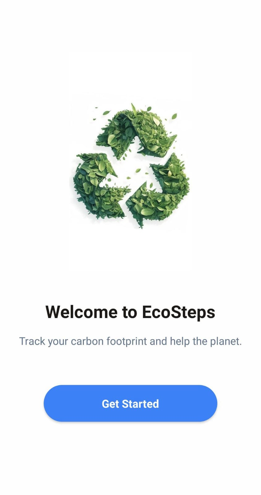
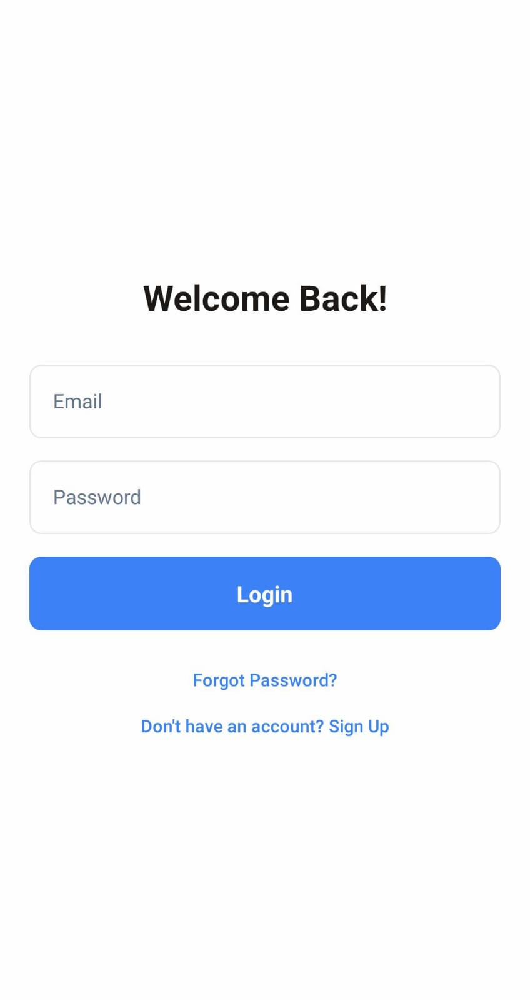
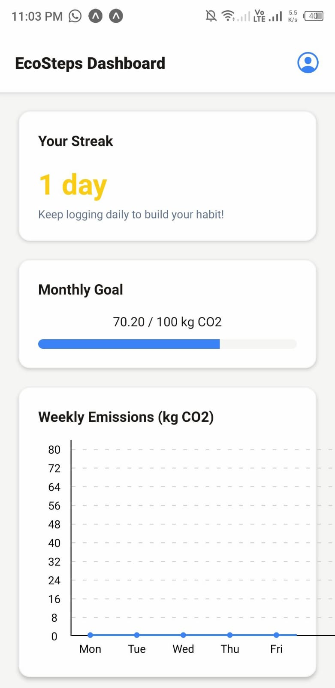
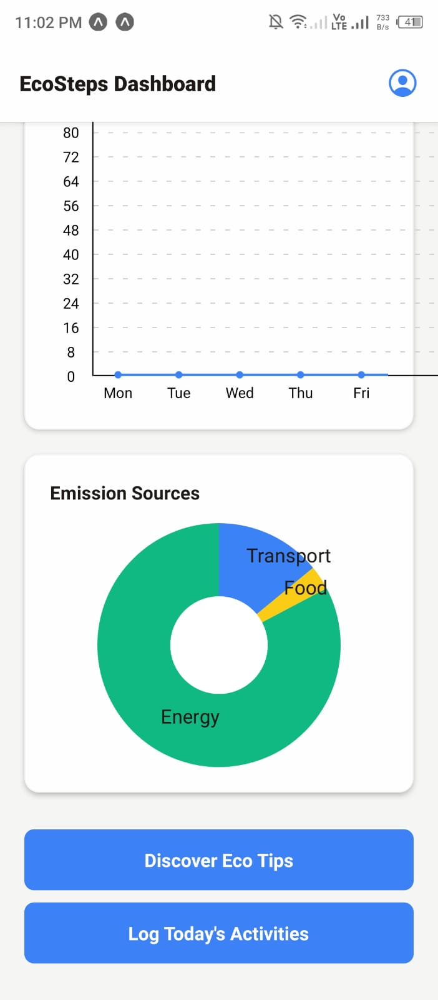
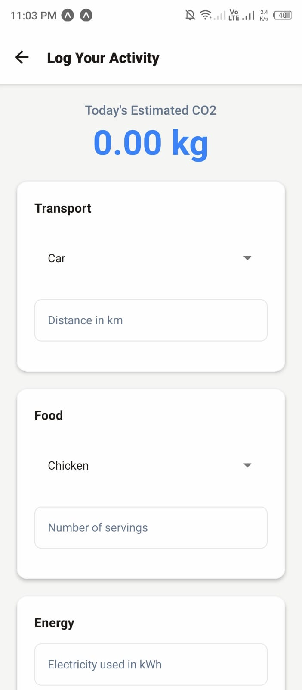
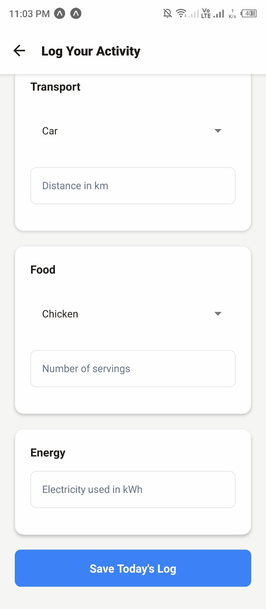
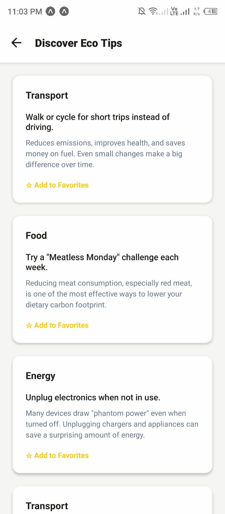
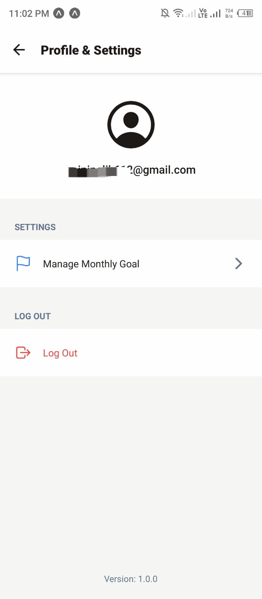

# 🌿 EcoSteps - A Carbon Footprint Tracker

A beautiful and fully functional mobile application designed to help users track their daily carbon footprint, build sustainable habits, and visualize their environmental impact. Built with **React Native** and powered by a complete **Firebase** backend, this project showcases a modern, feature-rich mobile experience focused on personal growth and environmental consciousness.

---

## Features

This application is packed with features that create a complete and motivational user journey:

*   **Firebase Authentication:** Secure user registration and login with email/password, with a full auth flow including onboarding and password reset.
*   **Dynamic Dashboard:** A central hub that visualizes user data with dynamic charts, progress bars, and motivational elements.
*   **Daily Activity Logging:** An intuitive interface to log daily activities across major categories: **Transport**, **Food**, and **Energy**.
*   **Real-Time CO₂ Calculation:** A custom `useCarbonCalculator` hook provides instant feedback on the carbon footprint of entered activities.
*   **Data Visualization:** Interactive **Line Charts** show weekly emission trends, and **Pie Charts** break down emission sources, helping users understand their impact.
*   **Goal Setting & Progress:** Users can set a personal monthly CO₂ reduction goal and track their progress with a sleek progress bar.
*   **Gamification (Streaks):** A streak tracker encourages users to log their activities daily, building a consistent, positive habit.
*   **Eco Tips & Favorites:** A dedicated screen with categorized lifestyle suggestions. Users can save their favorite tips locally using **AsyncStorage**.
*   **Daily Local Notifications:** Gentle, scheduled reminders to encourage users to log their activity, powered by `expo-notifications`.
*   **Secure & Scalable Backend:** **Firestore** rules are implemented to ensure users can only access and modify their own data.
*   **Elegant UI & Theming:** A clean, calming interface built with a centralized, scalable color theme.

---

## Tech Stack & Tools

This project leverages a modern and powerful set of tools to deliver a high-quality, data-driven mobile experience.

| Category             | Technology / Tool                                                                                                                                                                                                                                                                                       |
| -------------------- | ------------------------------------------------------------------------------------------------------------------------------------------------------------------------------------------------------------------------------------------------------------------------------------------------------- |
| **Core Framework**     |                                                                                                                                                                                           |
| **Platform & Build**   |                                                                                                                                                                                                             |
| **Backend & Database** |  (Authentication, Firestore)                                                                                                                                                                      |
| **Navigation**         |  (Stack Navigator)                                                                                                                                                            |
| **Data Visualization** |                                                                                                                                                                                      |
| **Date Management**    |                                                                                                                                                                                                  |
| **Styling**            | **React Native StyleSheet** (with a scalable `constants/colors.js` theme file)                                                                                                                                                                                                                          |
| **Version Control**    |  &                                                                                                                 |
| **Notifications**      |                                                                                                                                                                               |

---

## Screenshots

|                    Onboarding                     |                  Login                  |                    Dashboard                    |                    Dashboard                     |                   Activity Tracker                   |                   Activity Tracker                    |
|:-------------------------------------------------:|:---------------------------------------:|:-----------------------------------------------:|:------------------------------------------------:|:----------------------------------------------------:|:-----------------------------------------------------:|
|  |  |  |  |  |  |

|                 Eco Tips                  |                 Profile                 |
|:-----------------------------------------:|:----------------------------------------:|
|  |  |

---


## Getting Started

To run this project locally, follow these steps:

### Prerequisites

*   Node.js (LTS version)
*   Git
*   Expo Go app on your iOS or Android device

### 1. Clone the Repository

```bash
git clone https://github.com/[your-github-username]/EcoSteps.git
cd EcoSteps
```

### 2. Install Dependencies

This command will install all the necessary packages defined in `package.json`.
```bash
npm install
```

### 3. Set Up Firebase

This project requires a Firebase project to handle the backend.

1.  Go to the [Firebase Console](https://console.firebase.google.com/) and create a new project.
2.  Enable **Authentication** (Email/Password method).
3.  Enable **Firestore Database**.
   *   Navigate to the **Rules** tab and paste the following secure rules, then click **Publish**:
    ```rules
    rules_version = '2';
    service cloud.firestore {
      match /databases/{database}/documents {
        match /users/{userId} {
          allow read, update, delete: if request.auth.uid == userId;
          allow create: if request.auth.uid != null;
        }
        match /users/{userId}/activities/{activityId} {
          allow create, read: if request.auth.uid == userId;
        }
      }
    }
    ```
4.  From your project settings, create a new **Web App** and copy the `firebaseConfig` keys.
5.  In the root of this project, create a file named `.env`.
6.  Paste your Firebase keys into this new file. **(This file is in `.gitignore` to protect your keys!)**
    ```dotenv
    FIREBASE_API_KEY="your-api-key"
    FIREBASE_AUTH_DOMAIN="your-auth-domain"
    FIREBASE_PROJECT_ID="your-project-id"
    FIREBASE_STORAGE_BUCKET="your-storage-bucket"
    FIREBASE_MESSAGING_SENDER_ID="your-messaging-sender-id"
    FIREBASE_APP_ID="your-app-id"
    ```

### 4. Run the Application

Start the Metro bundler. It's recommended to clear the cache on the first run to ensure all dependencies are loaded correctly.
```bash
npx expo start -c
```
Scan the QR code with the Expo Go app on your phone.

---

## Key Learnings & Future Improvements

This project was an excellent exercise in building a data-driven, motivational mobile application. Key takeaways include:

*   **State Management with Hooks:** Combining React state with custom hooks (`useCarbonCalculator`) for clean and reusable business logic.
*   **Secure Backend Logic:** Implementing Firestore security rules to protect user data and ensure privacy.
*   **Motivational UI/UX:** Designing a dashboard that not only presents data but also encourages positive behavior through gamification elements like streaks and goals.

### Future Ideas:

*   [ ] **Dark Mode:** Implement a theme context to provide full dark mode support.
*   [ ] **Advanced Tracking:** Add categories for water usage and waste management.
*   [ ] **Carbon Offsetting:** Integrate with a service like Patch.io to allow users to offset their monthly footprint.
*   [ ] **Community Features:** Add leaderboards and team challenges to foster a sense of community.

---

## Author

**Zainab Malik**

*   GitHub: [@zaina-601](https://github.com/zaina-601/EcoSteps])

```